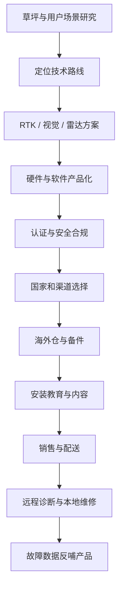

# 2026 AliExpress 品牌出海峰会调研 2.0：作战地图与作战链条

> 文档类型：现场调研 / 平台战略拆解 / 跨境经营作战方案  
> 调研来源：2026 阿里速卖通品牌出海峰会（上海站）现场议程、宣传册与演讲 PPT  
> 适用对象：品牌商、制造企业、智能硬件企业、跨境产品经理、出海创业者  
> 版本：V2.0  
> 更新时间：2026-07-30

---

## 0. 执行摘要

本次峰会释放的核心信号不是“速卖通又推出了一批补贴”，而是平台正在从单一跨境交易市场，升级为由 **商品、品牌、海外仓、本地履约、国家运营、营销和数据能力** 共同构成的全球经营基础设施。

平台 2026 年的资源倾斜可以归纳为五个增长引擎：

1. 合规新品；
2. 仓发货盘；
3. 分国别运营；
4. 本地化经营；
5. SA 重点商家扶持。

对商家的真实影响是：未来竞争不会只发生在 Listing、价格和广告层面，而会沿着以下链条展开：

> 市场洞察 → 产品定义 → 合规准入 → 供应链组织 → 海外仓备货 → 平台经营 → 国家化营销 → 本地履约 → 售后服务 → 品牌资产 → 数据复盘

对于割草机器人、户外机器人、消费电子、汽摩配等智能硬件企业，机会与门槛会同步提高。高客单、大件、本地售后复杂的商品更适合海外仓和海外托管，但也更考验库存、现金流、认证、备件、维修网络和退货处理能力。

---

# 1. 峰会事实层：现场信息整理

## 1.1 新商发品规则

现场 PPT 显示，2026 年起海外托管新发商品将更强调“一条商品链接对应一个发货国”。商家入驻后需要在限定周期内完成首批商品发布，以获得发品数量上限或权益提升。

标准发品阶段包括：

> 资质认证 → 商品信息提交 → 物流设置 → 商品定价 → 提交审核 → 商品上架

现场特别强调：

- 发货国与商品合规资质必须匹配；
- 支持通过店小秘、马帮、通途等 ERP 发品；
- 商品主图、场景图和白底图需要满足比例与内容规范；
- 不同国家、不同仓和不同履约方式需要独立配置。

## 1.2 海外托管新商权益

现场公布的新商权益大致覆盖：

- 极速入驻；
- 发品提效；
- 新品成长；
- 流量扶持；
- 物流补贴；
- 履约支持；
- 商业化补贴；
- 专属客服；
- 结算优化；
- 活动与品牌资源。

这些权益不能简单理解为“平台送钱”。其本质是平台用补贴降低商家进入海外仓、本地履约和新品经营的初始成本，从而把更多可控货盘和优质供给迁移到平台体系中。

## 1.3 平台提出的五类商品画像

现场展示的商品画像包括：

- 标品；
- 重大件；
- 轻小件；
- 非标商品；
- 品牌化商品组合。

不同商品画像对应不同经营模式：

| 商品类型 | 典型特征 | 更适合的经营方式 | 关键风险 |
|---|---|---|---|
| 标品 | 参数明确、可比价、搜索需求稳定 | POP、自运营、品牌运营 | 同质化和价格战 |
| 重大件 | 体积大、运费高、退货贵 | 海外仓、海外托管、本地履约 | 库存、尾程、退货和维修 |
| 轻小件 | SKU 多、配送方便、上新快 | 跨境托管、平台仓 | 毛利薄、跟卖和红海竞争 |
| 非标 | 款式、内容和趋势驱动 | 内容营销、达人、平台活动 | 预测困难、库存滞销 |
| 品牌商品 | 有产品差异、口碑和用户资产 | 多渠道、国家化运营 | 长期投入和组织能力 |

## 1.4 2026 业务方向

现场 PPT 对 2026 年业务方向的描述可以归纳为：

- 加大核心国家流量投入；
- 重构商业化模式，强化 PPC、联盟和内容达人能力；
- 持续发展本地 POP 与海外托管；
- 强化平台仓配和跨境履约能力；
- 针对五大品类推出差异化解决方案；
- 建立品牌出海营销能力；
- 从价格竞争逐步转向品牌和用户资产竞争。

---

# 2. 平台战略判断

## 2.1 AliExpress 正从平台变成经营基础设施

传统平台只解决“在哪里卖”的问题；新的 AliExpress 试图同时解决：

- 商品如何快速进入目标国家；
- 库存放在哪里；
- 谁负责配送；
- 如何做国家化流量；
- 如何支持品牌曝光；
- 如何处理售后和退货；
- 如何通过 ERP、仓配和数据形成规模经营。

因此，平台竞争的对象不再只是 Amazon、Temu 或 TikTok Shop，而是商家整个全球经营链路中的基础设施预算。

## 2.2 海外托管的商业本质

海外托管不是简单代运营，它更接近“平台主导的本地供给组织”。

商家主要负责：

- 产品研发与供货；
- 合规资料；
- 备货计划；
- 商品成本；
- 品质和产能；
- 约定范围内的售后责任。

平台主要承担或协调：

- 商品经营规则；
- 流量分发；
- 活动与营销；
- 仓配网络；
- 订单履约；
- 部分客服和售后流程；
- 数据反馈。

其优点是降低出海运营复杂度，缺点是商家对价格、流量、用户和品牌数据的控制力可能下降。因此，海外托管适合作为渠道，不应成为企业唯一经营身份。

## 2.3 五个增长引擎

### 引擎一：合规新品

平台希望获得持续、合法、差异化的新供给，而不是无限复制旧 Listing。商家应建立新品机制：

> 用户痛点 → 竞品差评 → 产品假设 → 打样 → 合规确认 → 小批测试 → 数据复盘 → 放量

### 引擎二：仓发货盘

仓发货盘意味着商品已经进入平台可控制的履约网络。平台更愿意给稳定库存、确定时效和低取消率的商品分配流量。

### 引擎三：分国别运营

同一商品在不同国家需要独立处理：

- 价格；
- 税务；
- 认证；
- 标题和关键词；
- 图片和卖点；
- 促销节奏；
- 客服语言；
- 配送承诺；
- 本地节日和文化。

### 引擎四：本地化

真正的本地化不是把中文翻译成外语，而是让消费者感受到这是一个能够在当地交付、响应和负责的品牌。

### 引擎五：SA 商家扶持

平台资源会向具有稳定供给、品牌潜力、履约能力和增长证明的商家集中。资源分配将越来越不平均，因此商家要通过数据和经营结果进入平台重点商家池。

---

# 3. 跨境出海总作战地图

作战地图不是线性项目计划，而是一个闭环。任何一个节点出现问题，都可能吞噬前端增长成果：

- 产品不合规，流量越大风险越高；
- 库存判断错误，销量越大现金越紧；
- 售后网络不足，订单越多差评越多；
- 单位经济不成立，GMV 增长反而扩大亏损。

---

# 4. 作战链条：从零到规模化经营

## 阶段 0：明确战略边界

**目标：** 确定做什么、不做什么。

输出物：

- 行业进入评分卡；
- 国家优先级表；
- 产品边界；
- 可承受亏损和库存上限；
- 12 个月验证目标。

退出条件：

- 找不到可验证的真实需求；
- 只能依靠极低价竞争；
- 售后和合规成本无法承担；
- 无法形成供应链控制力。

## 阶段 1：市场侦察

**目标：** 找到具体国家、具体用户、具体场景中的未满足需求。

行动：

1. 分析平台热销与增长品类；
2. 收集 Amazon、AliExpress、独立站和社媒差评；
3. 研究 Google Trends、关键词和论坛问题；
4. 访谈经销商、服务商和终端用户；
5. 比较不同国家准入、物流和售后条件。

核心指标：

- 目标关键词搜索量；
- 竞品价格带；
- 差评集中度；
- 询盘和访谈反馈；
- 渠道毛利空间。

## 阶段 2：产品定义与供应链组织

**目标：** 将市场问题变成可制造、可销售、可交付的产品。

行动：

- 定义核心场景与差异化卖点；
- 确认 BOM、MOQ、交期和产能；
- 建立样品测试标准；
- 明确包装、配件、备件和说明书；
- 将软件、App、固件和硬件版本纳入配置管理。

输出物：

- MRD / PRD；
- 产品规格书；
- 供应商评分表；
- 质量验收清单；
- 成本拆解表。

## 阶段 3：合规与准入

**目标：** 确保商品、主体、税务和宣传均可在目标市场持续经营。

检查项：

- CE、FCC、UKCA、RoHS 等认证；
- 电池、无线、电机和充电器要求；
- VAT、EPR、包装法和 WEEE；
- 商标与知识产权；
- 产品责任险；
- 用户隐私与 App 数据合规；
- 标签、警告语和说明书。

原则：先确认准入，再决定备货；不要先形成库存，再补合规。

## 阶段 4：单位经济和现金流闸门

**目标：** 确认每卖一台是否真正产生贡献毛利。

基本模型：

> 净收入 = 售价 - 折扣 - 平台扣费 - 税费

> 单台贡献毛利 = 净收入 - 商品成本 - 头程 - 仓储 - 尾程 - 广告 - 售后准备金 - 退货损失

必须做三种情景：

- 基准情景；
- 乐观情景；
- 最坏情景。

重大件尤其要计入：

- 体积重；
- 入库和操作费；
- 长期仓储费；
- 二次配送；
- 无理由退货；
- 维修和换新；
- 滞销清仓。

## 阶段 5：渠道与经营模式组合

建议采用“平台成交 + 独立站沉淀 + B2B 渠道扩张”的组合，而不是单平台依赖。

| 渠道 | 作用 | 适合阶段 |
|---|---|---|
| AliExpress 海外托管 | 快速进入平台本地履约体系 | 冷启动和规模测试 |
| Amazon | 高意图消费与成熟履约 | 产品验证后放量 |
| TikTok Shop | 内容驱动新品教育 | 高视觉表现产品 |
| 独立站 | 品牌、SEO、数据和高毛利 | 中长期资产沉淀 |
| 经销商 / B2B | 大单、本地服务和行业渠道 | 复杂产品和重大件 |

## 阶段 6：海外仓与备货

**目标：** 用最少库存满足承诺时效，而不是盲目压货。

关键机制：

- 首批小批量；
- 安全库存；
- 补货点；
- 库龄预警；
- 国家间调拨；
- 备件独立库存；
- 退货分级处理。

建议建立库存红线：

- 30 天：健康库存；
- 60 天：需要调整投放与补货；
- 90 天：进入去库存方案；
- 120 天以上：按现金回收优先处理。

## 阶段 7：国家化运营

每个国家建立一张“国家经营卡”：

- 目标用户；
- 核心场景；
- 主流价格带；
- 主要竞品；
- 认证与税务；
- 渠道组合；
- 本地节日；
- 内容表达；
- 客服语言；
- 售后网络；
- P&L 与库存。

## 阶段 8：流量与内容

内容必须服务于成交、信任和售后成本下降。

内容支柱：

1. 产品效果；
2. 使用场景；
3. 技术原理；
4. 安装和维护；
5. 对比和选型；
6. 客户案例；
7. 工厂与质量；
8. 常见故障解释。

AI 可以用于：

- 多语言商品文案；
- 国家化关键词；
- 视频脚本；
- 客服知识库；
- 评论聚类；
- 广告素材变体；
- 售后原因分类；
- 周报与经营复盘。

AI 不应替代：

- 产品差异化；
- 真实测试；
- 本地服务；
- 合规责任；
- 供应链控制。

## 阶段 9：交易、履约和售后

重大件商品的核心不是把货卖出去，而是完整闭环：

> 下单 → 仓库出库 → 尾程配送 → 签收 → 安装 → 使用 → 故障处理 → 维修 / 换货 → 复购 / 推荐

必须提前设计：

- 远程诊断；
- 日志上传；
- 故障码体系；
- 备件包；
- 维修合作方；
- DOA 处理；
- 退货授权；
- 翻新和二次销售。

## 阶段 10：品牌和数据资产

最终目标不是只获得订单，而是积累：

- 品牌搜索量；
- 用户评价；
- 邮件和会员；
- 客户案例；
- 经销商关系；
- 国家经营数据；
- 产品故障数据；
- 供应商和成本数据；
- 可复用 SOP。

---

# 5. 智能割草机器人专项作战链条

智能割草机器人属于高客单、重大件、软硬件结合、本地售后要求高的商品，适合用来训练完整出海经营能力。

## 5.1 产品层

重点不是参数堆叠，而是解决：

- 建图是否稳定；
- 边界识别是否可靠；
- 多区域是否易用；
- 坡度、坑洼和窄通道是否可通过；
- 回充是否稳定；
- 雨天和异常是否安全；
- App 是否能解释设备状态；
- 用户是否能快速排障。

## 5.2 国家层

欧洲适合重点研究：

- 草坪密度和独立住宅比例；
- 法规与认证；
- 经销商和园林渠道；
- 本地维修成本；
- 消费者对品牌和隐私的要求。

美国适合重点研究：

- 大草坪和高功率需求；
- 庭院服务商渠道；
- 产品责任风险；
- 配送距离和退货成本；
- Home Depot、Lowe's、Amazon 等渠道结构。

## 5.3 售后层

建议按三级体系建设：

- L1：App 指引、FAQ、视频和 AI 客服；
- L2：远程日志、参数诊断、固件和配网支持；
- L3：备件寄送、本地维修、整机换新。

---

# 6. 作战指挥盘：指标体系

## 6.1 市场指标

- 目标关键词增长率；
- 竞品评论和差评分布；
- 国家市场询盘量；
- 经销商有效访谈数；
- 内容自然触达量。

## 6.2 商品指标

- 上新周期；
- 首批合规通过率；
- 样品问题关闭率；
- 转化率；
- 新品 30 / 60 / 90 天销售表现。

## 6.3 履约指标

- 库存周转天数；
- 缺货率；
- 发货及时率；
- 妥投时效；
- 取消率；
- 退货率；
- 维修时长。

## 6.4 财务指标

- 单台贡献毛利；
- 广告后毛利；
- 售后准备金占比；
- 库存现金占用；
- 国家 P&L；
- 回款周期；
- 现金转换周期。

## 6.5 品牌指标

- 品牌词搜索量；
- 自然流量占比；
- 好评率；
- NPS；
- 复购和推荐；
- 经销商数量；
- 独立站留资率。

---

# 7. 风险地图

| 风险 | 典型表现 | 防御动作 |
|---|---|---|
| 平台依赖 | 流量、价格或规则变化即失速 | 多渠道、独立站、客户数据沉淀 |
| 库存风险 | 海外仓滞销、仓租上涨 | 小批测试、补货模型、库龄红线 |
| 合规风险 | 下架、罚款、召回 | 准入清单、第三方检测、持续监控 |
| 质量风险 | 高退货、高差评、换新成本 | 样品验证、批次追踪、故障闭环 |
| 售后风险 | 无本地维修、整机退货 | 备件、本地服务商、远程诊断 |
| 现金流风险 | GMV 增长但现金断裂 | 国家 P&L、库存上限、回款监控 |
| 品牌风险 | 只靠低价，无复购和溢价 | 内容、案例、产品差异和服务 |
| 数据风险 | 平台掌握用户，企业无资产 | CRM、独立站、邮件和会员体系 |

---

# 8. 90 天行动计划

## 0—30 天：调研与建模

- [ ] 建立 AliExpress 海外托管政策清单；
- [ ] 选择 1 个国家和 1 个品类作为样板；
- [ ] 完成 20 个竞品和 500 条差评分析；
- [ ] 建立产品单位经济模型；
- [ ] 访谈 5 家供应商、3 家海外仓、3 家渠道商；
- [ ] 输出第一版国家经营卡。

## 31—60 天：产品和渠道验证

- [ ] 确定 1—3 个 MVP 商品；
- [ ] 完成样品测试和合规差距表；
- [ ] 设计商品页、视频和本地化内容；
- [ ] 获取海外仓完整报价；
- [ ] 完成平台、独立站和 B2B 渠道组合方案；
- [ ] 制定首批备货和退出机制。

## 61—90 天：小规模实战

- [ ] 发布首批商品；
- [ ] 启动小预算广告和内容实验；
- [ ] 建立订单、库存、客服和售后看板；
- [ ] 每周复盘转化、毛利、退货和问题；
- [ ] 决定继续放量、调整产品或停止项目；
- [ ] 将经验沉淀为 SOP 和案例。

---

# 9. 决策闸门

项目只有同时通过以下闸门，才允许进入下一阶段：

1. **需求闸门**：存在真实、持续且可触达的需求；
2. **产品闸门**：产品能够形成明确差异和稳定交付；
3. **合规闸门**：目标国家准入条件明确且可承担；
4. **经济闸门**：最坏情景下现金损失可控；
5. **履约闸门**：海外仓、配送、退货和售后可闭环；
6. **组织闸门**：有人对产品、库存、销售和售后结果负责；
7. **资产闸门**：项目能够沉淀品牌、客户、数据或渠道资产。

---

# 10. 最终结论

本次峰会的真正结论不是“速卖通值得不值得做”，而是全球跨境电商正在从低门槛铺货，进入以 **合规产品、海外库存、国家经营、本地交付和品牌资产** 为核心的新阶段。

对个人和中小企业而言，最优策略不是立刻重仓开店，而是先建立一条能够反复验证的作战链：

> 先市场 → 后产品 → 小批验证 → 单位经济 → 本地履约 → 多渠道增长 → 品牌与数据沉淀

对于智能硬件和割草机器人行业，应把平台视为放大器，而不是能力本身。真正长期有效的壁垒依然来自：

- 对目标市场和用户场景的理解；
- 对软硬件产品的定义和质量控制；
- 对合规、供应链和现金流的管理；
- 对本地服务和售后网络的组织；
- 对品牌、客户和经营数据的持续积累。

这套作战地图后续应继续连接国家市场研究、产品供应链、增长渠道、经营财务和 AI Business OS，形成可被持续复用和迭代的跨境经营系统。